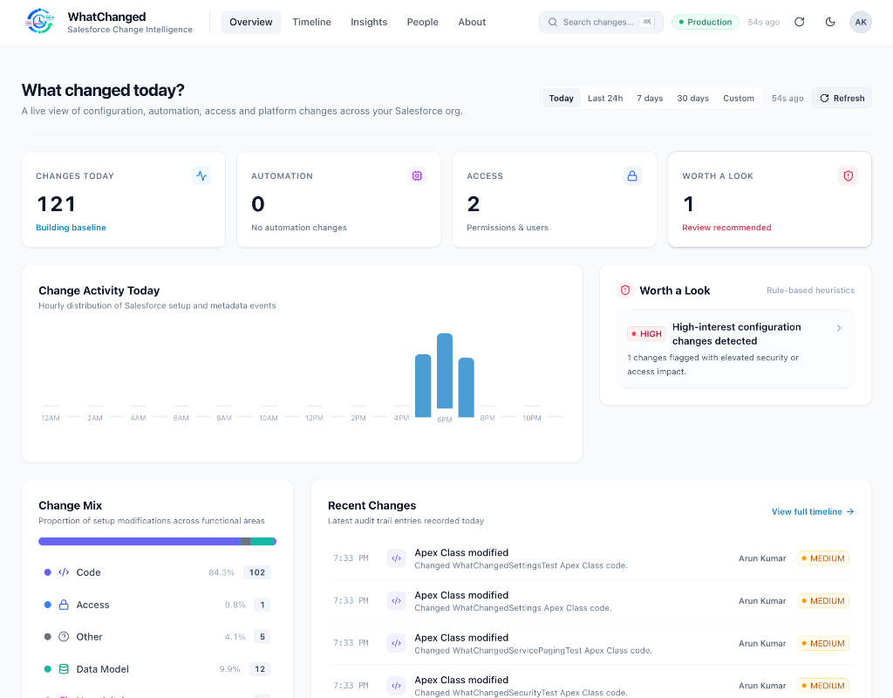
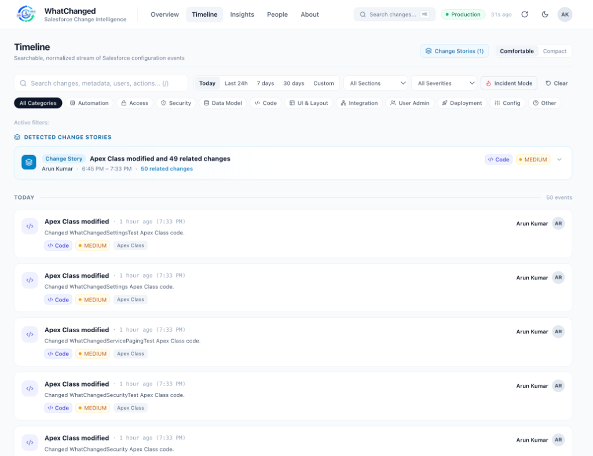
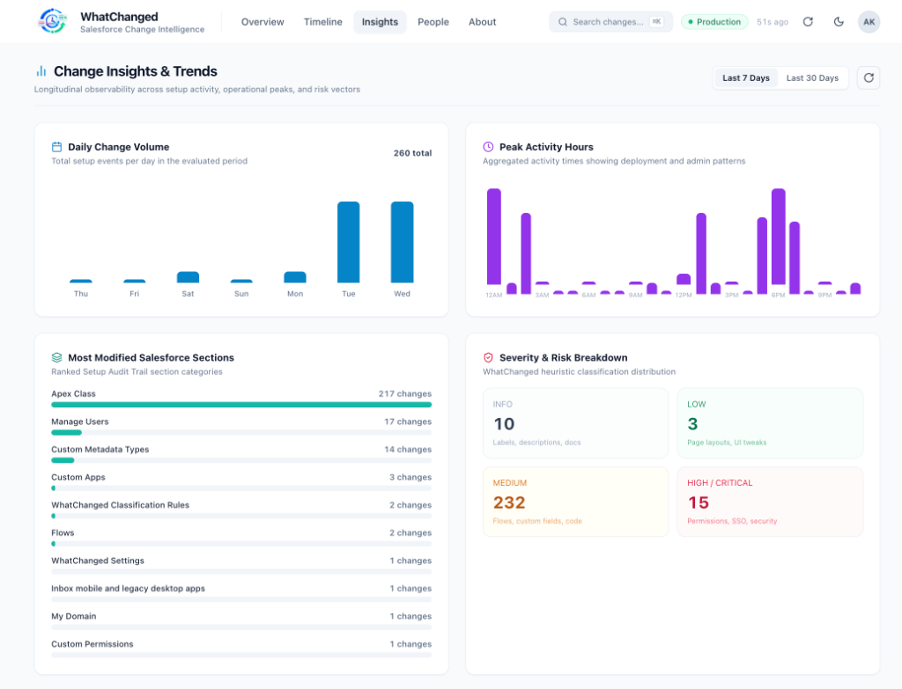
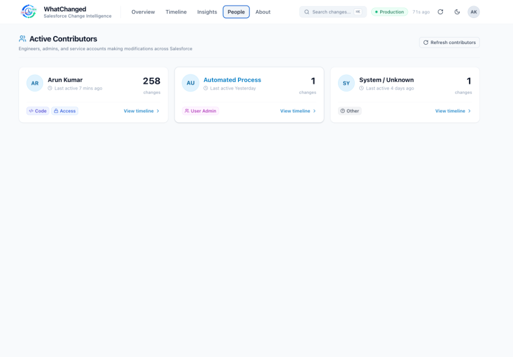
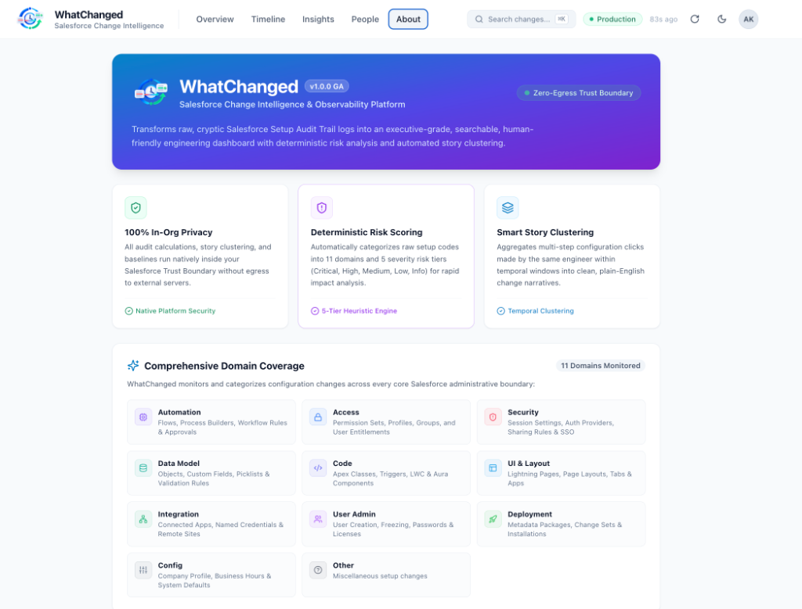

# WhatChanged — Salesforce Change Intelligence

> **Your Salesforce org, explained.**  
> A native, framework-agnostic **React** application running directly on the Salesforce Platform using **Salesforce Multi-Framework** (GA).

Turn Salesforce's raw, cryptic `SetupAuditTrail` and platform configuration events into a modern, real-time engineering observability and change intelligence experience. Built for Salesforce Architects, Engineering Leads, DevOps Engineers, and System Administrators.

---

## ⚡ Highlights & Key Features

* **Executive Observability Dashboard**: High-level KPIs (*Changes Today, Automation, Access, Worth a Look*), dynamic weekday baselines, hourly activity charts, and category breakdowns.
* **Normalized Change Stories**: Automatically groups discrete configuration edits made by the same engineer within a short time window into human-readable, cohesive stories (e.g. *"Jane Smith updated Account Permissions & Custom Fields"*).
* **Incident Investigation Mode**: Narrow down and correlate all platform modifications around a critical outage or release timestamp (e.g., `3:15 PM ± 30 minutes`).
* **Deterministic Classification Engine**: Maps hundreds of cryptic Salesforce `SetupAuditTrail` action codes into 11 functional categories and 5 risk tiers (`INFO`, `LOW`, `MEDIUM`, `HIGH`, `CRITICAL`).
* **Contributor Intelligence**: Team-level observability into the most active platform contributors and their primary focus areas.
* **Longitudinal Trends & Insights**: 7-day and 30-day visual metrics covering top modified setup sections, severity distributions, and peak operational hours.
* **Global Command Palette (`⌘K` or `/`)**: Quick keyboard navigation, rapid search, and instant category filtering from anywhere in the application.
* **Dark & Light Modes**: Modern, high-contrast themes with system preference detection and instant client-side toggle.
* **Zero-Token Auth & Native Security**: Uses Salesforce Multi-Framework and `@salesforce/platform-sdk/data` with server-side `WhatChanged_Access` custom permission enforcement.

---

## 📸 Screenshots & Walkthrough

### 1. Executive Overview Dashboard
> Real-time platform KPI summary cards (*Changes Today, Automation, Access, Worth a Look*), hourly change activity breakdown, and rule-based heuristic highlights.



### 2. Timeline & Change Stories
> Searchable, real-time stream of Salesforce configuration events with 11 domain filters, Incident Mode, and automated story clustering.



### 3. Change Insights & Longitudinal Trends
> 7-day and 30-day observability covering daily change volume, peak activity hours, top modified setup sections, and risk breakdown.



### 4. Active Contributor Intelligence
> Real-time visibility into engineers, administrators, and automated service accounts making modifications across Salesforce.



### 5. Platform Architecture & Domain Coverage
> In-org execution details, 100% data privacy with zero external egress, and coverage across all 11 Salesforce administration domains.



---

## 🏛️ Architecture

```
User (Salesforce App Launcher)
   ↓
Salesforce App Domain (https://<org>--<ns>.<instance>.my.salesforce.app/app/c__whatChangedApp)
   ↓
Native Multi-Framework React Runtime (UIBundle: c__whatChangedApp)
   ↓ @salesforce/platform-sdk/data (createDataSDK)
Salesforce Apex REST API (/services/apexrest/what-changed/v1/*)
   ↓
WhatChangedSecurity (Custom Permission Gate: WhatChanged_Access)
   ↓
WhatChangedAuditService (Orchestration, Baselines, Stories)
   ↓
WhatChangedClassifier & WhatChangedEventNormalizer
   ↓
WhatChangedAuditRepository (SOQL Keyset Pagination)
   ↓
Salesforce SetupAuditTrail
```

---

## 📋 Prerequisites

Before deploying to your Salesforce org, ensure you have:

1. **Node.js**: `v22.0.0` or higher (`node -v`)
2. **Salesforce CLI**: `@salesforce/cli` version `2.130.7` or higher (`sf version`)
3. **Salesforce Org Requirements**:
   * Any Developer Edition, Sandbox, Scratch Org, or Production org hosted on **Hyperforce** (e.g. instance prefix like `IND56`, `USA10`, `GBR10`).
   * **Salesforce Edge Network Enabled**:
     * In Salesforce Setup → **My Domain** → scroll to **Routing** → verify **"Use Salesforce Edge Network"** is enabled.
   * English set as default org language.

---

## 🚀 Quick Start (Deploy to Salesforce Org in 5 Steps)

### Step 1: Clone the Repository & Install Dependencies

```bash
git clone https://github.com/arun12209/WhatChanged.git
cd WhatChanged

# Install React application dependencies
npm --prefix force-app/main/default/uiBundles/whatChangedApp install
```

### Step 2: Build the Production React Bundle

```bash
npm run build
```

This compiles TypeScript and builds the production React application into `force-app/main/default/uiBundles/whatChangedApp/dist/`.

### Step 3: Authenticate to your Salesforce Org

```bash
sf org login web --alias my-salesforce-org --instance-url https://login.salesforce.com
```

### Step 4: Deploy Metadata to your Org

Deploy the Apex REST backend, Custom Permissions, Permission Sets, Custom Application, and the React `UIBundle`:

```bash
sf project deploy start --source-dir force-app/main/default --target-org my-salesforce-org --wait 30
```

### Step 5: Assign the Permission Set

Assign the `WhatChanged_User` permission set to yourself and your team:

```bash
sf org assign permset --name WhatChanged_User --target-org my-salesforce-org
```

---

## 🧪 Run Apex Unit Tests

Verify that all Apex classes and security checks pass with 100% test coverage:

```bash
sf apex run test --tests WhatChangedClassifierTest,WhatChangedEventNormalizerTest,WhatChangedAuditServiceTest,WhatChangedSecurityTest,WhatChangedApiTest --target-org my-salesforce-org --wait 10
```

---

## 🖥️ How to Access WhatChanged in Salesforce

1. Log in to your Salesforce org in your browser.
2. Click the **App Launcher (9 dots icon)** in the upper-left corner.
3. Search for **`WhatChanged`** and click the application icon.
4. **Direct URL**: You can also navigate directly to:
   ```text
   https://<your-org-domain>--c.develop.my.salesforce.app/app/c__whatChangedApp
   ```

---

## 💻 Local Development & Standalone Demo Mode

WhatChanged can also be run locally with a standalone Vite dev server. In standalone mode, it automatically boots with realistic Salesforce demo data:

```bash
npm run dev
```

* Navigate to `http://localhost:5173`.
* Run frontend unit tests (Vitest):
  ```bash
  npm run test
  ```

---

## 📦 Project Directory Structure

```text
WhatChanged/
├── force-app/main/default/
│   ├── applications/
│   │   └── WhatChanged.app-meta.xml      # CustomApplication referencing c__whatChangedApp
│   ├── classes/
│   │   ├── WhatChangedApi.cls             # Apex REST controllers (/summary, /events, /people, /insights)
│   │   ├── WhatChangedAuditService.cls    # Business logic, baselines, and story clustering
│   │   ├── WhatChangedAuditRepository.cls # Keyset pagination and repository abstraction
│   │   ├── WhatChangedClassifier.cls      # Deterministic category and severity classifier
│   │   ├── WhatChangedEventNormalizer.cls # Event title and narrative normalizer
│   │   ├── WhatChangedSecurity.cls        # Security validation and permission checks
│   │   ├── WhatChangedDtos.cls            # Strongly-typed data transfer objects
│   │   └── *Test.cls                      # Comprehensive Apex unit tests
│   ├── customPermissions/
│   │   └── WhatChanged_Access.customPermission-meta.xml
│   ├── permissionsets/
│   │   └── WhatChanged_User.permissionset-meta.xml
│   └── uiBundles/
│       └── whatChangedApp/                # React + Vite + TypeScript frontend
│           ├── whatChangedApp.uibundle-meta.xml
│           ├── ui-bundle.json
│           ├── package.json
│           ├── vite.config.ts
│           ├── src/
│           │   ├── components/            # Shell, BrandLogo, Header, Drawer, CommandPalette
│           │   ├── data/                  # Salesforce Data SDK Client and API layer
│           │   ├── domain/                # Categories, Severity, Types, Constants
│           │   ├── features/              # Overview, Timeline, Insights, People, About
│           │   ├── hooks/                 # Custom React hooks (auto-refresh, filters, theme)
│           │   └── utils/                 # Formatting, date calculations, URL state
│           └── dist/                      # Compiled production assets
├── docs/
│   ├── ARCHITECTURE.md                    # Detailed architecture specifications
│   ├── DESIGN_SYSTEM.md                   # Visual tokens, styling, and UI components
│   └── screenshots/                       # High-resolution application screenshots
├── sfdx-project.json
├── package.json
└── README.md
```

---

## 🔐 Security & Governance

* **Zero Token Storage**: Authentication is handled implicitly by the platform Multi-Framework runtime container. No access tokens or OAuth credentials are stored in cookies, localStorage, or JavaScript variables.
* **Hard Origin Isolation**: The `salesforce.app` domain runs in a separate browser origin, leveraging native Same-Origin Policy (SOP) to isolate React applications from administrative Salesforce session cookies.
* **Strict Permission Checks**: All server-side endpoints invoke `WhatChangedSecurity.requireAccess()`. Users without the `WhatChanged_Access` permission receive a `403 FORBIDDEN` response without leaking stack traces or metadata.

---

## 📄 License

MIT License — free for personal, commercial, and enterprise use.
